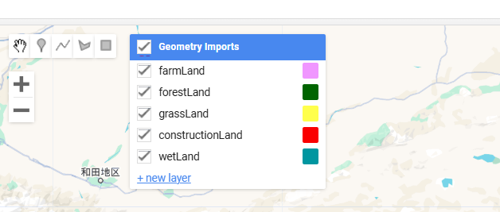
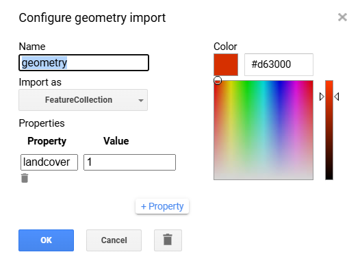
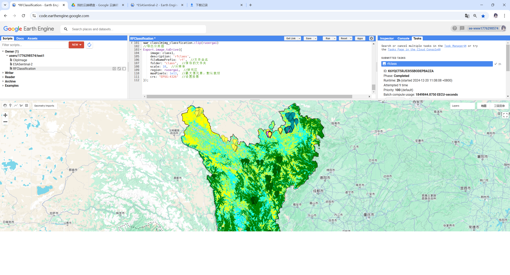

# 随机森林分类

## 导入数据

```javascript
var ruoergai = ee.FeatureCollection("projects/ee-www1776298574/assets/ruoergai"),
    farmLand = /* color: #f096ff */ee.FeatureCollection([]),
    forestLand = /* color: #006400 */ee.FeatureCollection([]),
    grassLand = /* color: #ffff4c */ee.FeatureCollection([]),
    constructionLand = /* color: #fa0000 */ee.FeatureCollection([]),
    wetLand = /* color: #0096a0 */ee.FeatureCollection([]),
    dem = ee.Image("NASA/NASADEM_HGT/001");
```

第一行导入资产中矢量边界数据，可自行命名（如我的是ruoergai，后续代码中若有ruoergai则替换为自己设置名字）

后五行为分类体系，不用敲后面会根据自己的分类体系自动生成

最后为NASA的30m分辨率高程数据导入

## 分类体系定义



点击new layer添加分类体系



name按分类体系自行设置，导入设置为featurecollection，属性里填写landcover（后面分类代码中所定义），value按顺序设置（推荐1~n），ok确认添加

## 标记训练点位

```javascript
//加载矢量边框，以便于在边界内选取样本点
var empty = ee.Image().toByte();
var outline = empty.paint({
    featureCollection:ruoergai, // 行政边界命名为fc
    color:0, //颜色透明
    width:1 //边界宽度
});
Map.addLayer(outline, {palette: "ff0000"}, "outline");
```

先输入并运行此部分代码，在地图上显示出边界后，开启地图右上角卫星地图方便标点

点击刚刚设置的分类体系，并在地图上标记点位，每种分类最少六十个点


若代码最上方import部分中对应的分类名称后标记数字增加则为标注成功

## 训练

代码中//注释请注意

```javascript
//哨兵二号去云函数
function maskS2clouds(image) {
    var qa = image.select('QA60');

    // Bits 10 and 11 are clouds and cirrus, respectively.
    var cloudBitMask = 1 << 10;
    var cirrusBitMask = 1 << 11;

    // Both flags should be set to zero, indicating clear conditions.
    var mask = qa.bitwiseAnd(cloudBitMask).eq(0)
        .and(qa.bitwiseAnd(cirrusBitMask).eq(0));

    return image.updateMask(mask).divide(10000);
}

//导入哨兵2号影像
var dataset = ee.ImageCollection('COPERNICUS/S2_SR_HARMONIZED')
    .filterDate('2023-01-01','2023-12-31')
    .filterBounds(ruoergai)//注意修改
    .filter(ee.Filter.lt('CLOUDY_PIXEL_PERCENTAGE',20))
    .map(maskS2clouds);
print("Sentinel 2 Image Collection",dataset);

// 遥感光合指数计算(NDVI\NDWI\EVI\BSI)
var add_RS_index = function(img){
    var ndvi = img.normalizedDifference(['B8', 'B4']).rename('NDVI').copyProperties(img,['system:time_start']);
    var ndwi = img.normalizedDifference(['B3', 'B8']).rename('NDWI').copyProperties(img,['system:time_start']);
    var evi = img.expression('2.5 * ((NIR - RED) / (NIR + 6 * RED - 7.5 * BLUE + 1))',
        {
            'NIR': img.select('B8'),
            'RED': img.select('B4'),
            'BLUE': img.select('B2')
        }).rename('EVI').copyProperties(img,['system:time_start']);
    var bsi = img.expression('((RED + SWIR1) - (NIR + BLUE)) / ((RED + SWIR1) + (NIR + BLUE)) ',
        {
            'RED': img.select('B4'),
            'BLUE': img.select('B2'),
            'NIR': img.select('B8'),
            'SWIR1': img.select('B11'),

        }).rename('BSI').copyProperties(img,['system:time_start']);


    var ibi = img.expression('(2 * SWIR1 / (SWIR1 + NIR) - (NIR / (NIR + RED) + GREEN / (GREEN + SWIR1))) / (2 * SWIR1 / (SWIR1 + NIR) + (NIR / (NIR + RED) + GREEN / (GREEN + SWIR1)))', {
        'SWIR1': img.select('B11'),
        'NIR': img.select('B8'),
        'RED': img.select('B4'),
        'GREEN': img.select('B3')
    }).rename('IBI').copyProperties(img,['system:time_start']);
    return img.addBands([ndvi, ndwi, evi, bsi, ibi]);
};

var dataset = dataset.map(add_RS_index);
var bands = ['B2','B3','B4','B5','B6','B7','B8','B8A','B11','NDVI','NDWI','BSI'];
var imgcol_median = dataset.select(bands).median();
var ruoergai_dem = dem.select('elevation').clip(ruoergai).rename('DEM');//注意修改
var construct_img = imgcol_median.addBands(ruoergai_dem).clip(ruoergai);//注意修改
//分类样本
var train_points = farmLand.merge(forestLand).merge(grassLand).merge(constructionLand).merge(wetLand);//这是我的分类体系从farmLand开始的五类
var train_data= construct_img.sampleRegions({
    collection: train_points,
    properties: ['landcover'],
    scale: 10
});
//精度评价
var withRandom = train_data.randomColumn('random');//样本点随机的排列
var split = 0.7;
var trainingPartition = withRandom.filter(ee.Filter.lt('random', split));//筛选70%的样本作为训练样本
var testingPartition = withRandom.filter(ee.Filter.gte('random', split));//筛选30%的样本作为测试样本
//分类方法选择随机森林
var rf = ee.Classifier.smileRandomForest({
    numberOfTrees: 20,
    bagFraction: 0.8
}).train({
    features: trainingPartition,
    classProperty: 'landcover',
    inputProperties: bands
});
//对哨兵数据进行随机森林分类
var img_classfication = construct_img.classify(rf);
//运用测试样本分类，确定要进行函数运算的数据集以及函数
var test = testingPartition.classify(rf);
//计算混淆矩阵
var confusionMatrix = test.errorMatrix('landcover', 'classification');
print('confusionMatrix',confusionMatrix);//面板上显示混淆矩阵
print('overall accuracy', confusionMatrix.accuracy());//面板上显示总体精度
print('kappa accuracy', confusionMatrix.kappa());//面板上显示kappa值
Map.centerObject(ruoergai)//注意修改
Map.addLayer(ruoergai);//注意修改
Map.addLayer(img_classfication.clip(ruoergai), {min: 1, max: 5, palette: ['pink', 'green', 'yellow','red','cyan']});//注意修改数量和颜色（颜色随便写就行，主要是value范围）
var class1=img_classfication.clip(ruoergai)
//导出分类图
Export.image.toDrive({
    image: class1,
    description: 'rfclass',
    fileNamePrefix: 'rf',  //文件命名
    folder: "class",  //保存的文件夹
    scale: 10,  //分辨率
    region: ruoergai,  //研究区
    maxPixels: 1e13,  //最大像元素，默认就好
    crs: "EPSG:4326"  //设置投影
});
```

## 分类结果


